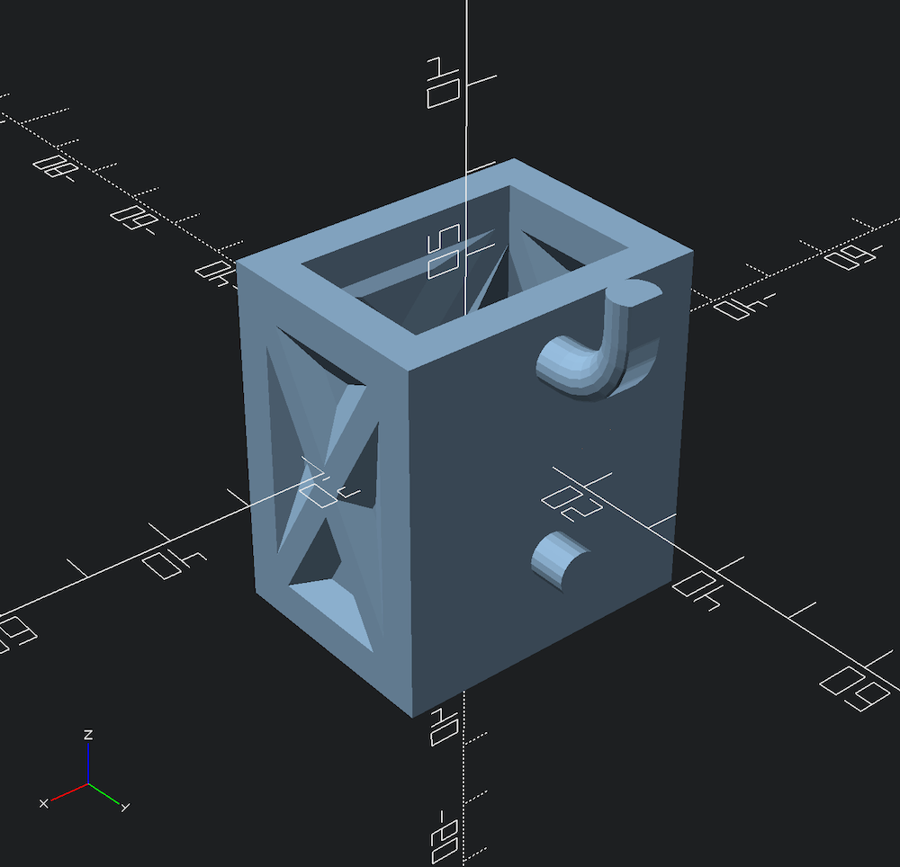
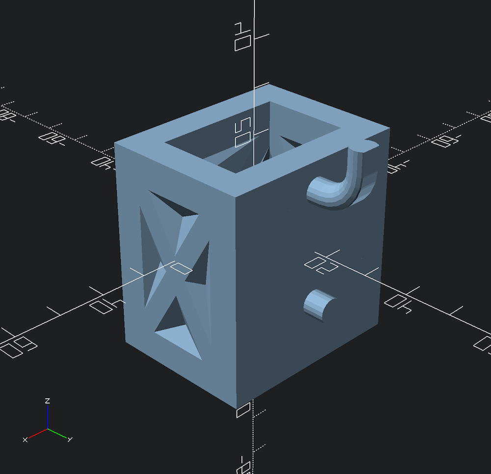
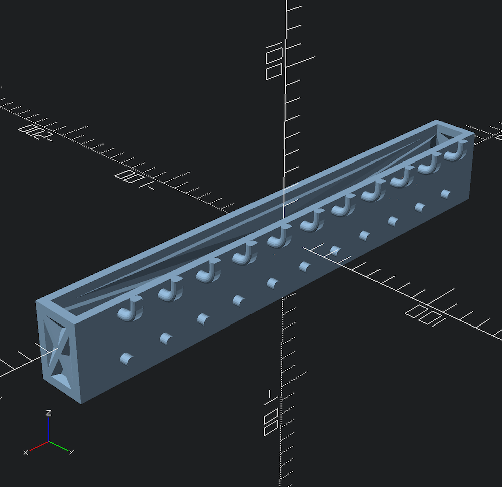
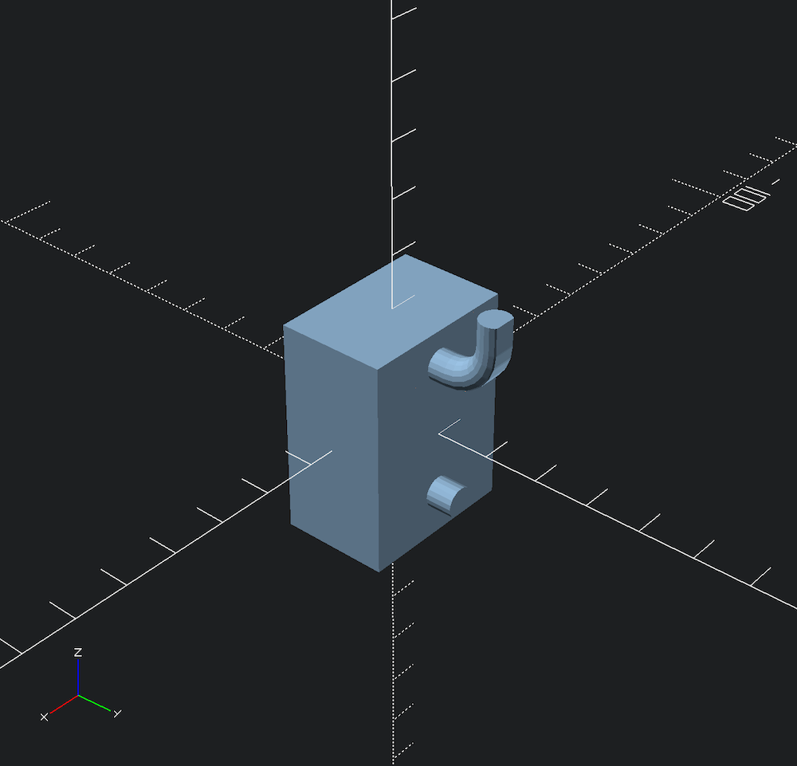
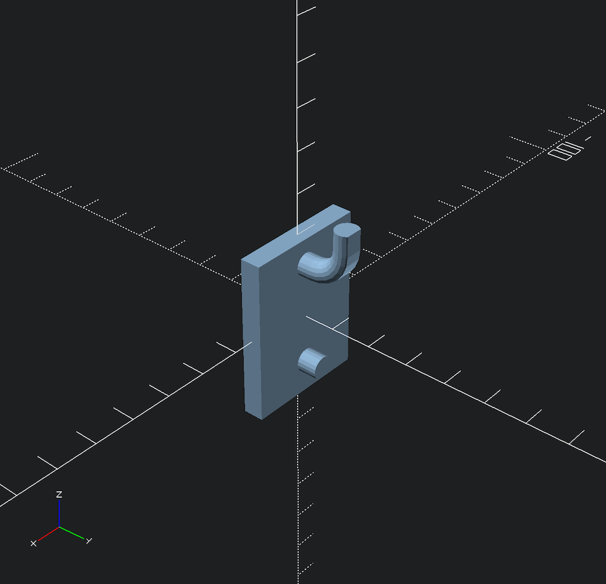
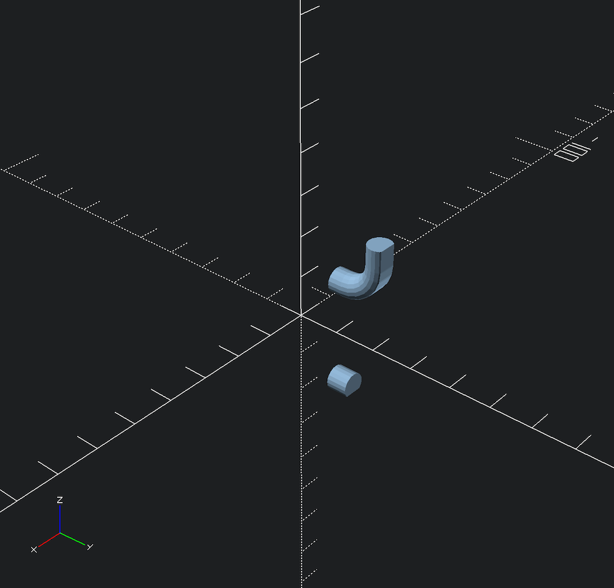
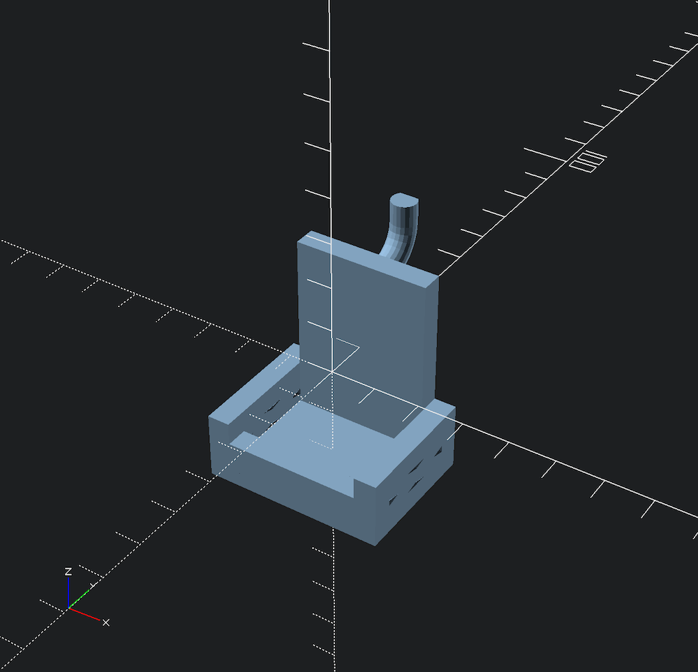
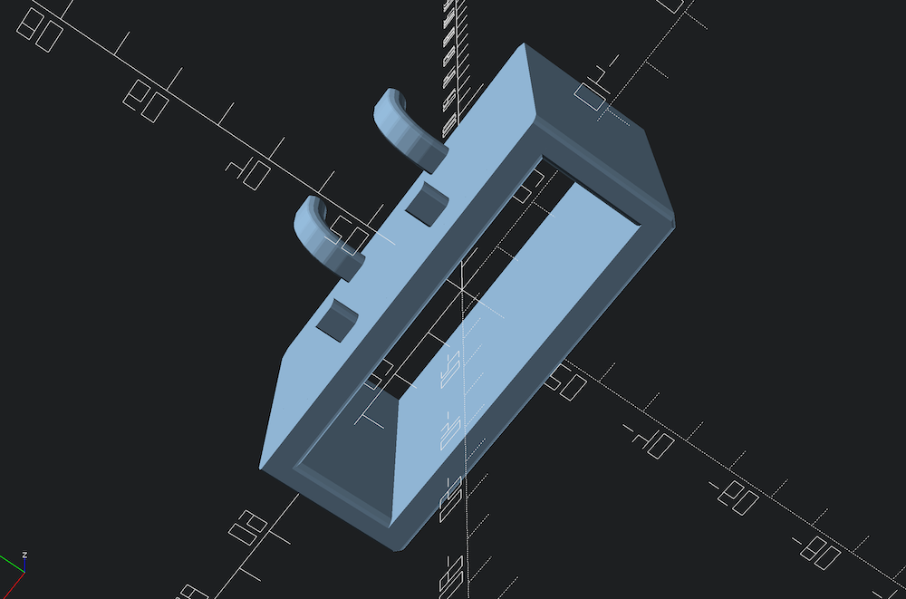
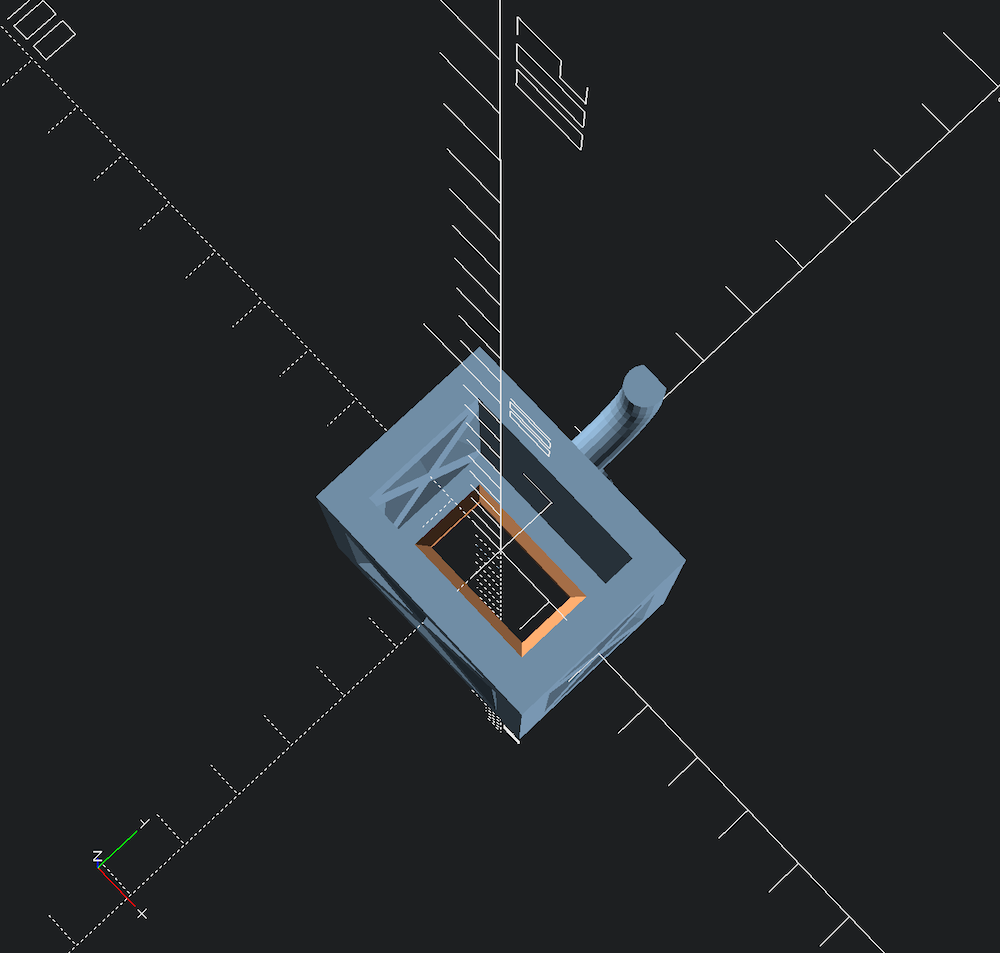

# Pegmixer

An OpenSCAD pegboard accessory generator and toolkit library.

## Why

Pegboards are awesome for organization: everything is visible and it's super adaptable for a variety of items. 3D printing can make custom parts quickly and easily. 

They're a great match. If you scroll through STL sites (printables, thingiverse, etc.) you'll be disappointed. Many models are difficult to print, have poorly designed pegs that are too weak or with incorrect spacing, and might not work for the specific item you're trying to organize.

## How

Pegmixer is a parametric-first library: everything is adjustable, but comes with defaults that make getting started easier. It uses a [fluent-like interface](https://en.wikipedia.org/wiki/Fluent_interface) where you chain together modules in a parent/child relationship. 

Say, you have an object that is 30mm wide, 20mm deep, and 40mm tall. With Pegmixer, you would use the following OpenSCAD code:

```
pegmixer()
    box([30, 20, 40]);
```

This would generate the following accessory:



If you pay close attention to the rulers, the box itself is not 30x20x40, but rather the _inside_ dimension is that size. You are **declaring** the size of the item you want and Pegmixer calculates the rest for you (using defaults). Not every operation in Pegmixer is declarative, but many are.

Now, if you want something a bit beefier, you can specify a different wall thickness as a argument on the `pegmixer` module:

```
pegmixer(wall_thickness= 7)
    box([30,20,40]);
```

The inner dimension remains the same, but the wall thickness has increased:



If you look at the pegs itself, you'll notice a couple of things: 
1. The shape of the pegs is not perfectly circular
2. Vertically there is a curved peg and a short peg, but horizontally there is only one set.

By default, the pegs are optimized for FDM 3D Printing. In most cases you will need to generate supports under the pegs in your slicer, but slicers are terrible at supporting something like a truly round cantilever. Instead, Pegmixer includes a flattened profile that prints cleanly with supports so that they snap right off. You can also specify your own profile (more on that later).

There is only one set of pegs because the specified size can only support one set of pegs based on the spacing default. If you make a wider `box` then it will have more pegs. Pegs are easy to print, so Pegmixer calculates the maximum number based on the size. 

As an example, here is a (silly) box that is 300mm wide (`box([300,20,40])`), it has quite a few sets of pegs:



Pegmixer offers a ton more functionality than this. See the later sections for further examples.

## API Documentation

### Root
#### `pegmixer`
- **parent**:  none 
- **arguments**:

| name                     | Description                                                                                          | default |
|--------------------------|------------------------------------------------------------------------------------------------------|---------|
| `spacing`                | The center-to-center spacing of the pegboard (mm)                                                    | 25.4    |
| `hole_d`                 | The actual diameter of the pegboard hole (mm)                                                        | 6.35    |
|  `board_thickness`       | The thickness of the pegboard (mm)                                                                   | 6.35    |
| `peg_hole_percentage`    | The multiplier of the `hole_d` as tolerance (percentage as 0-1)                                      | 0.9     |
| `peg_flatten_percentage` | The multiplier used to flatten the bottom of the peg for easier printing (percentage as 0-1)         | 0.8     |
| `alignment_peg_length`   | The length of the lower peg (mm)                                                                     | 5       |
| `arc_d_mul`              | The multiplier to `board_thickness` used to determine the curvature of the upper hook (a number)     | 2.5     |
| `extension_length_mul`   | The multiplier to `board_thickness` used to determine the vertical part of the upper hook (a number) | 0.5     |
| `wall_thickness`         | The thickness of the walls of any boxes generated as children (mm)                                   | 5       |
| `chamfer_divide`         | The division of the `wall_thickness` used to determine the chamfer width                             | 3       |

Calling `pegmixer` without any children is effectively a noop.

###  Box and related modification modules

#### `box`

- **parent**: `pegmixer`
- **arguments**:

| name            |  description  |  default  |
|------------|--------------|-----------|
| `dims`          | XYZ size vector | none    |
| `use_thinning`  | Creates walls with a thin center and struts at all four corners. See [BOSL2's documentation for the `thinning_wall` module](https://github.com/BelfrySCAD/BOSL2/wiki/walls.scad#module-thinning_wall) | `true`  |
| `wall_thinning` | The thickness of a thinned wall. Has no effect if `use_thinning` is set to `false`. See [BOSL2's documentation for the `thick` argument in the `thinning_wall` module](https://github.com/BelfrySCAD/BOSL2/wiki/walls.scad#module-thinning_wall)                   | 1       |
| `use_brace`     | If `true` thinned walls will use diagonal braces. Has no effect if `use_thinning` is set to `false`. See [BOSL2's documentation for the `braces` argument in the `thinning_wall` module](https://github.com/BelfrySCAD/BOSL2/wiki/walls.scad#module-thinning_wall) |  true       |

This will create an open-top box that will hold `dims` (e.g. inside volume) and will place the correct number of pegs on the back.

If no child is supplied, `default_peg_set` will be used.

#### `solid`

- **parent**: `pegmixer`
- **arguments**:

| name | description     | default |
|------|-----------------|---------|
| dims | XYZ size vector | none    |
This will create a solid cube of size `dims` and will place the correct number of pegs on the back. Useful if you want to subtract geometry from the cube.

If no child is supplied, `default_peg_set` will be used.

Example:

```
pegmixer()
    solid([30,20,40]);
```




#### `plate`
- **parent**: `pegmixer`
- **arguments**:

| name | description     | default |
|------|-----------------|---------|
| dims | XYZ size vector (Y will be ignored) | none    |
This will create a plate of X wide, `wall_thickness` thick, and Z tall and will place the correct number of pegs on the back.

If no child is supplied, `default_peg_set` will be used.

Example:

```
pegmixer()
    plate([30,20,40]);
```



#### `virtual`
- **parent**: `pegmixer`
- **arguments**:

| name | description | default |
|------|-----------------|---------|
| dims | XYZ size vector | none    |
This will position the pegs _as if_ a solid of `dims` size existed. Useful if you have a pre-existing shape you want to add correctly positioned pegs to.

If no child is supplied, `default_peg_set` will be used.

Example:

```
pegmixer()
    virtual([30,20,40]);
```



#### `slingify_box`
- **parent**: `pegmixer`
- **child**: `box`
- **arguments**:

| name           | description                                   | default |
|----------------|-----------------------------------------------|---------|
| `side_height`  | height of the left and right sides of the box | See description.    |
| `front_height` | height of the front of the box                | See description.    |
|                |                                               |         |

Makes the child `box` into a "sling" where the back wall height is dictated by the `box`es `dims.z` and the other wall heights of the box are dictated my the arguments here. The arguments technically do not have defaults the sides or front will only be altered if the argument is supplied.

Useful for creating U-shaped holders or small boxes that have a higher back (for center of gravity reasons).

#### `slideify_box`
- **parent**: `pegmixer`
- **child**: `box`
- **arguments**: none

Removes the left and right wall, but adds a top wall. Great if you want to slide an object through the sides. 

Example:

```
pegmixer()
    slingify_box(
        side_height= 15,
        front_height= 10
    )
        box([30,20,40]);
```




### `bottomless`
- **parent**: `pegmixer`
- **child**: `box`
- **arguments**: none

Any `box` created will lack a bottom. Useful if you need to hold something with a flared edge. This will correctly render rounded edges on the bottom compared to creating a `box_bottom_hole` with the same x/y dimensions as the opening.

Example:

```
pegmixer()
    bottomless()
        box(
            use_thinning= false, 
            [65, 18.3, 40]
        );
```



#### `box_bottom_hole`
- **parent**: `pegmixer`
- **child**: `box`
- **arguments**:

| name | description    | default |
|------|----------------|---------|
| dims | XY size vector | none    |
Punches a hole in the bottom of the `box` of size `dims`. Useful when you want to pass a cable or protrusion through the bottom of the box. 

Example:

```
pegmixer()
    box_bottom_hole([20,10])
        box([30,20,40]);
```




### Pegs, hooks, and related modification modules

#### `hook`
- **parent**: `hook_pair` (optional) or any Pegmixer geometry
- **child**: `flattened_peg_profile` or any 2D shape
- **arguments**: none

Draws the upper (curved) peg.

#### `alignment_peg`
- **parent**: `hook_pair` (optional) or any Pegmixer geometry
- **child**: `flattened_peg_profile` or any 2D shape 
- **arguments**: none

Draws the lower (curved) peg.


#### `default_peg_set`
- **parent**: (any Pegmixer geometry)
- **child**: `hook_pair` 
- **arguments**: none

Draws the upper (curved) peg (`hook`) and the lower (straight) alignment peg (`alignment_peg`).

#### `hook_pair`
- **parent**: (any Pegmixer geometry)
- **child**:  Two of any 3d geometry modules
- **arguments**: none

The first child module  is aligned as the upper peg and the second child module is aligned as the lower (alignment) peg. All other children are ignored.


#### `hook_single`
- **parent**: (any Pegmixer geometry)
- **child**:  One of any 3d geometry modules
- **arguments**: none

The first child module is aligned as the upper peg. All other children are ignored.

#### `flattened_peg_profile`
- **parent**: `alignment_peg` or `hook`
- **child**:  none
- **arguments**: none

Draws a 2D shape used to extrude the alignment and hook pegs, with the width determined by `pegmixer`'s `hole_d` multiplied by `peg_hole_percentage` . It is flattened by `peg_flatten_percentage`. 

### Functions

#### `min_back_wall
- **arguments**: 

| name      | description | default |
|-----------|-------------|---------|
| `spacing` | (mm)        | none    |
| `hole_d`  | (mm)        | none    |

For the given `spacing` and `hole_d` return the calculated minimum back wall height

#### `back_wall_height`
- **arguments**: 

| name      | description | default |
|-----------|-------------|---------|
| `spacing` | (mm)        | none    |

Takes `s.z` and returns the height of the back wall.

## Other samples

### `samples/readme.scad`

Contains the examples for this document.

### `samples/hex-bit.scad`

A hex driver bit organizer implemented in Pegmixer


### `samples/hole.scad`

A box with different style walls and a hole in the bottom.


### `samples/hook-on-hook.scad`

An example of using `virtual` and custom hook profile.


### `samples/multimeter.scad`

An example of cutting the front of a `box`


### `samples/slide-in.scad`

An example of creating a slide-in holder.


### `samples/paper-towel-holder.scad`

An example showing a `solid` as a back plate for other geometry.


### `samples/bottle.scad`

An example of rounding off a solid and using `min_back_wall` for dimensions.


## Installation & usage

This project requires use of the [BOSL2 Library](https://github.com/BelfrySCAD/BOSL2). You can add BOSL2 to your [OpenSCAD libraries](https://en.wikibooks.org/wiki/OpenSCAD_User_Manual/Libraries#Library_locations) or you can clone the repo directly into the directory.

To use Pegmixer, either `include` or `use` it in your OpenSCAD file:

```
include </path/to/pegmixer.scad>
```

or

```
use </path/to/pegmixer.scad>
```

See the [OpenSCAD user manual ](https://en.wikibooks.org/wiki/OpenSCAD_User_Manual/Include_Statement)for which one is right in your circumstance. Pegmixer does not execute anything as a library, so it really comes down to access to global library variables, which you may or or may not want.


## License 

This project is licensed under the [Solderpad Hardware License v2.1](http://solderpad.org/licenses/SHL-2.1/) which is a wraparound license to the Apache License Version 2.0. 