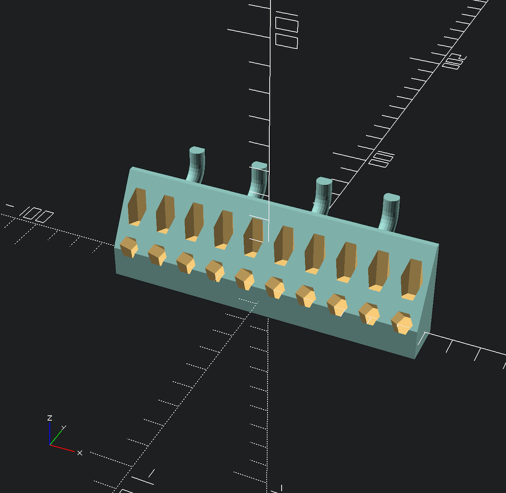
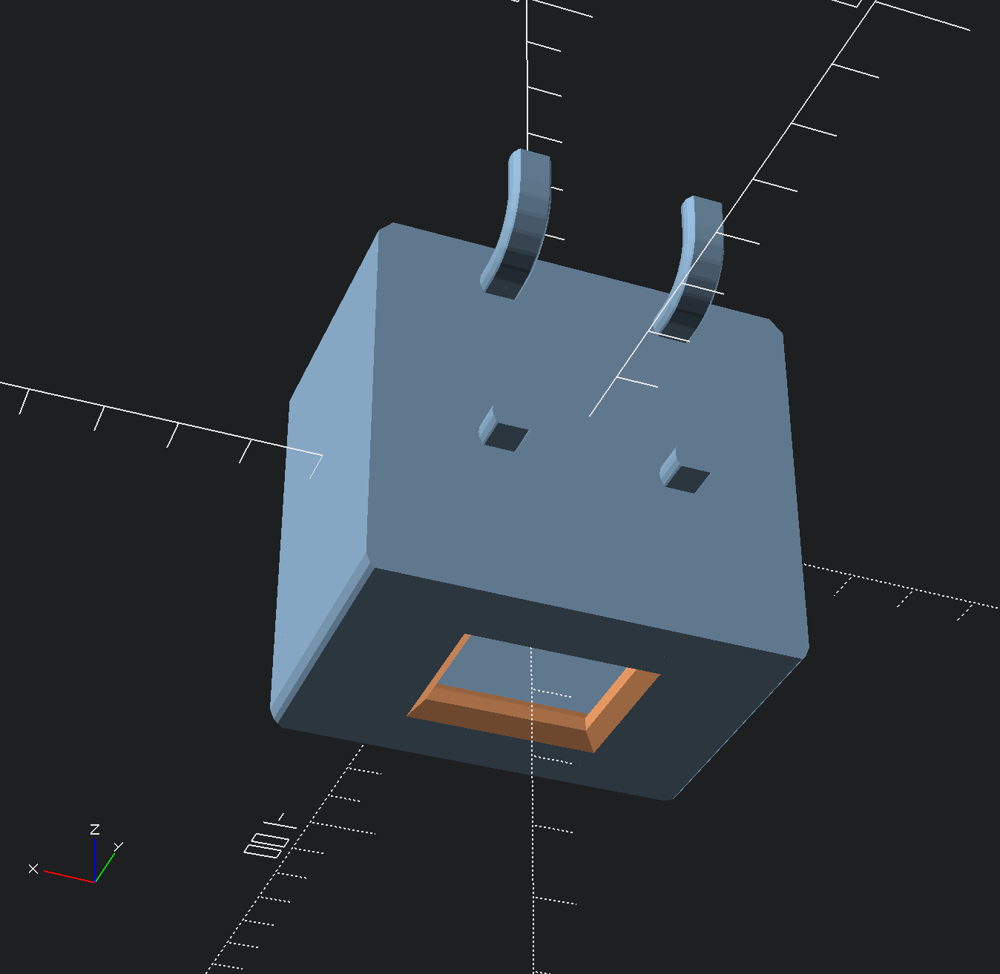
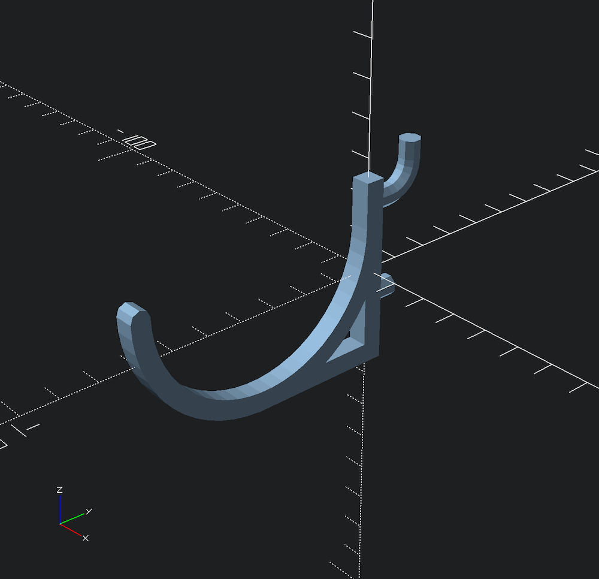
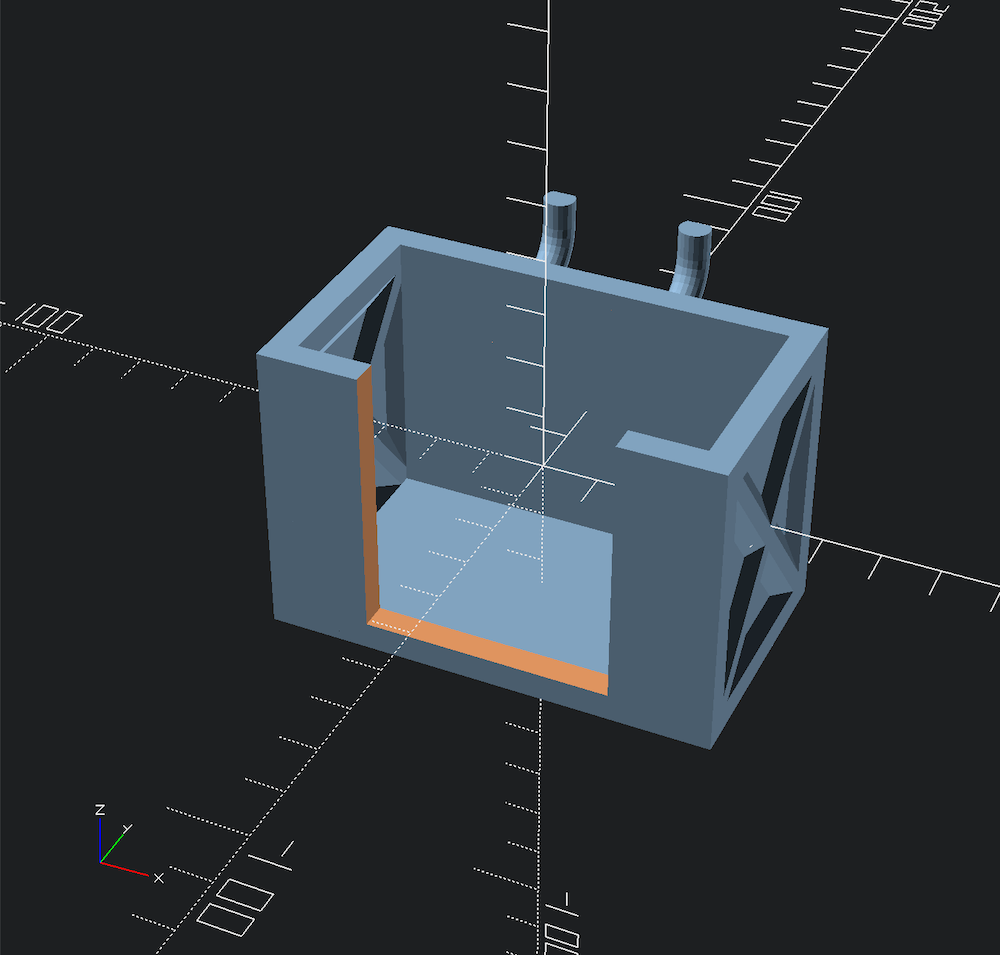
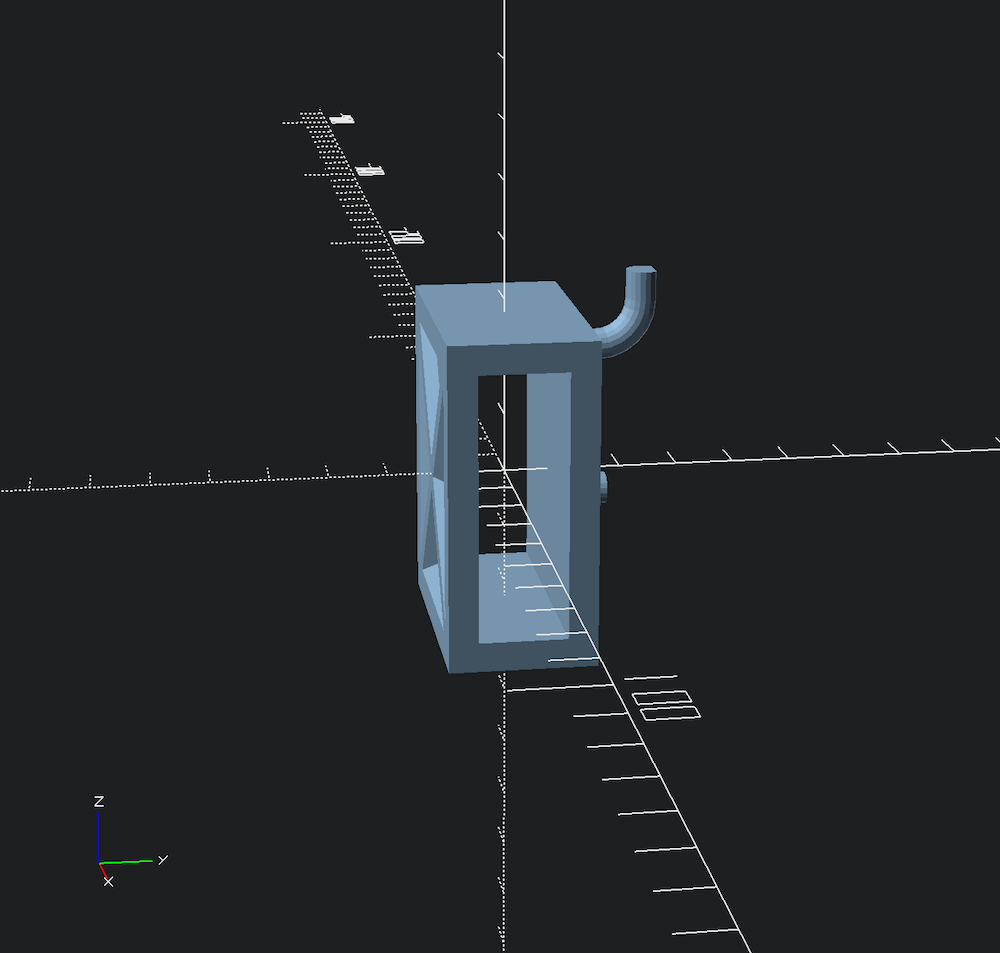
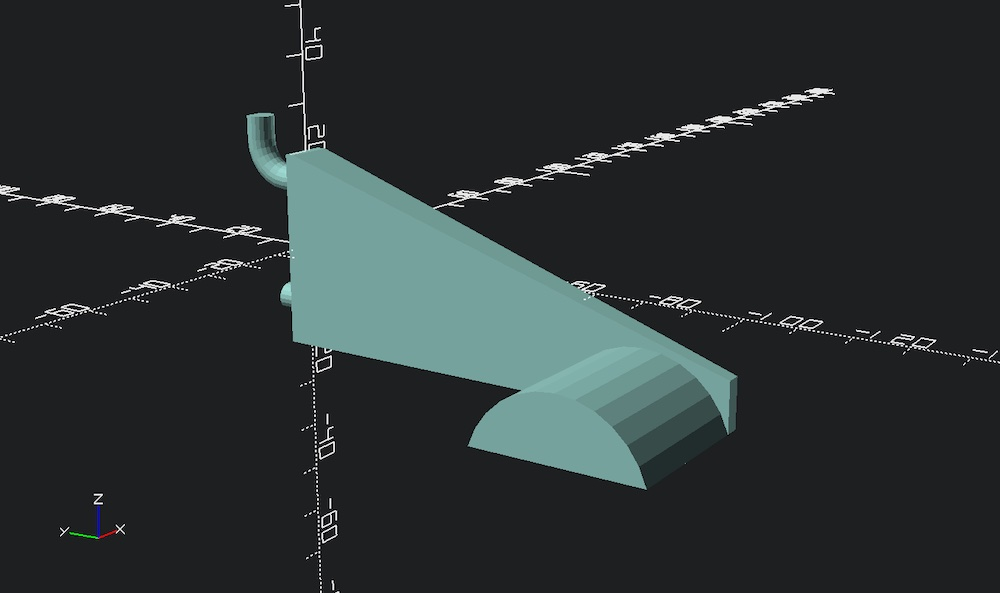
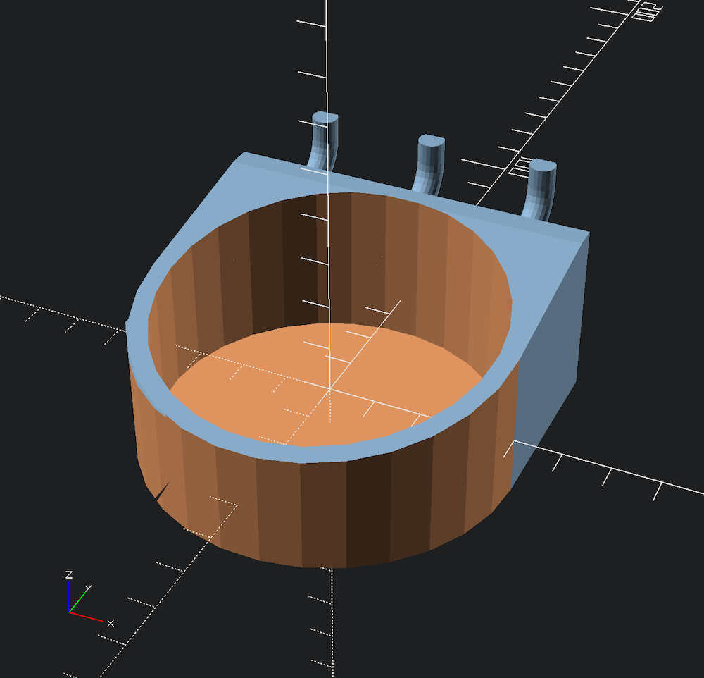
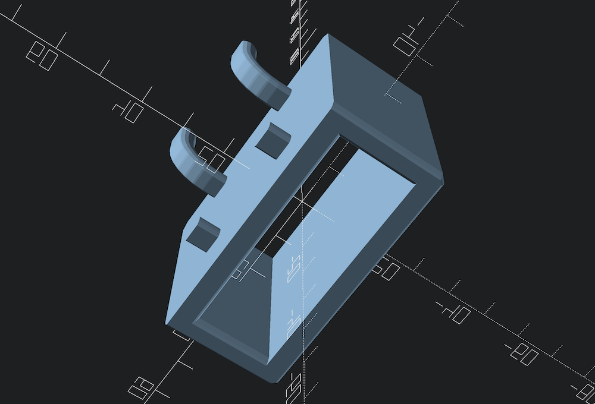
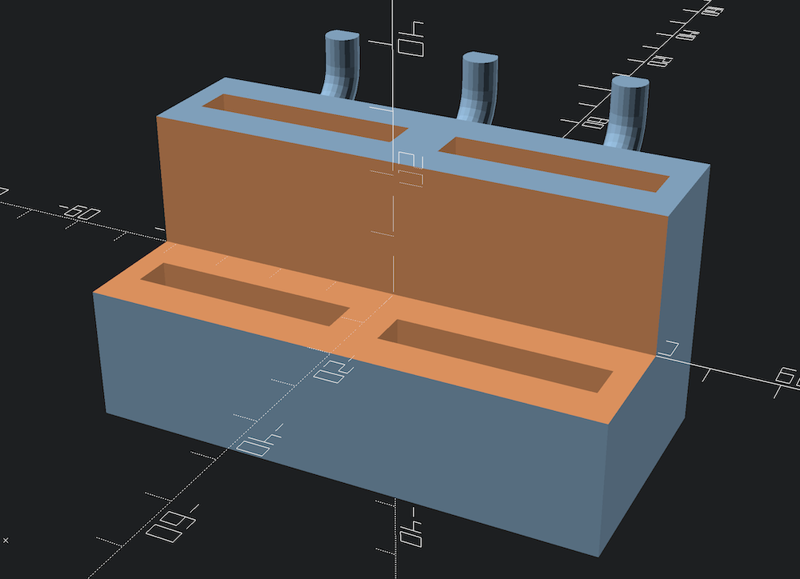

# Pegmixer Samples

This directory contains a number of small models that use Pegmixer. 

### `samples/readme.scad`

Contains samples for the main README document.

### `samples/hex-bit.scad`

A hex driver bit organizer implemented in Pegmixer

### `samples/hole.scad`

A box with different style walls and a hole in the bottom.

### `samples/hook-on-hook.scad`

An example of using `virtual` and custom hook profile.

### `samples/multimeter.scad`

An example of cutting the front of a `box`

### `samples/slide-in.scad`

An example of creating a slide-in holder.

### `samples/paper-towel-holder.scad`

An example showing a `solid` as a back plate for other geometry.

### `samples/bottle.scad`

An example of rounding off a solid and using `min_back_wall` for dimensions.

## `samples/iwiss-crimping-tool.scad`

A holder for the common iwiss IWS-3220M crimping tool. Uses a `bottomless` box.

## `samples/hs-series-die-holder.scad`

A holder for HS series crimper dies. It shows how to calculate a 2-tier "step". You can change the die capacity by altering `number_of_jaws`.

## `samples/hs-series-crimper-holder.scad`

This is the same as the readme example for `bottomless`.

